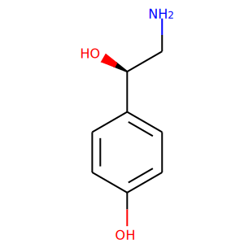
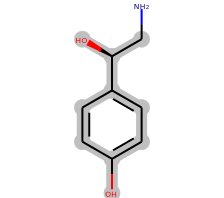
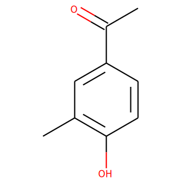

```{eval-rst}
.. _similarities
```
# Similar ligands

The pipeline calculates pairwise comparison of ligands using [PARITY method](https://doi.org/10.1016/j.str.2018.02.009). If the two ligands are similar with 60% and more, their common substructure is recorded.

## Process

The comparison method is a commutative method (e.g. A sim B == B sim A). For some 30K ligands there would be 900M comparisons, however, in practice just half of them are needed. That is why the pipeline internally differentiates between `--init` and `--update`.  Init mode calculates just the lower triangle of the similarity matrix, whereas the update mode computes the full similarity matrix, however rows != columns in this case. If a ligand is updated and rereleased all the similarity relationships are removed from the database prior to the computation, in order to avoid db inconsistency.

The computation on the farm is synchronized using redis queue. There is a separate process that reads the content of the redis queue and writes it out in a format that can be used for graph DB loading.

PARITY method is computationally demmaning, therefore it is recommended to use as many workers as possible. Using more workers than the number of ligands have no effect on the calculation speed.

## Database content

The loading of the data to Graph DB is taken care of the two files generated by the pipeline. CSV file with the atom-atom maping information and parity score and `*.txt` file that defines the relationship between the two nodes in the file.

### CSV file

Importantly, START_ID and END_ID nodes are lexicographically ordered by the ligand ID. This decision has been made in order to query database irrespective of the order in which the molecules were compared (see example below). This ordering is a prerequisite for correct perception of atom-atom mapping.

#### Example of the CSV file

| :START_ID(Chemical_Component)    | :END_ID(Chemical_Component)   | ATOM_MAPPING | SIMILARITY_SCORE |
| ----------- |---------------| ------------------| -------------- |
| YRL | YTP | C09:C9;C08:C7;C01:C4;C02:C3;C04:C2;C06:C1;C05:C6;C03:C5;O07:O11 | 0.75

### Config file

This file contains just a single line with similarity name and path to the CSV file e.g. -relationships:HAS_SIMILARITY `/nfs/nobackup/msd/lukas/similarities/Chemical_Component_Chemical_Component_Rels.csv`

## Result

A comparison for a pair of molecules is provided to better illustrate how PARITY works.

<div style="align: center">
    <table>
    <thead style="text-align: center">
        <tr>
            <td>OTR</td>
            <td>substructure</td>
            <td>YTP</td>
        </tr>
    </thead>
    <tbody>
    <tr>
        <td></td>
        <td></td>
        <td></td>
    </tr>
    </tbody>
</table>
</div>
